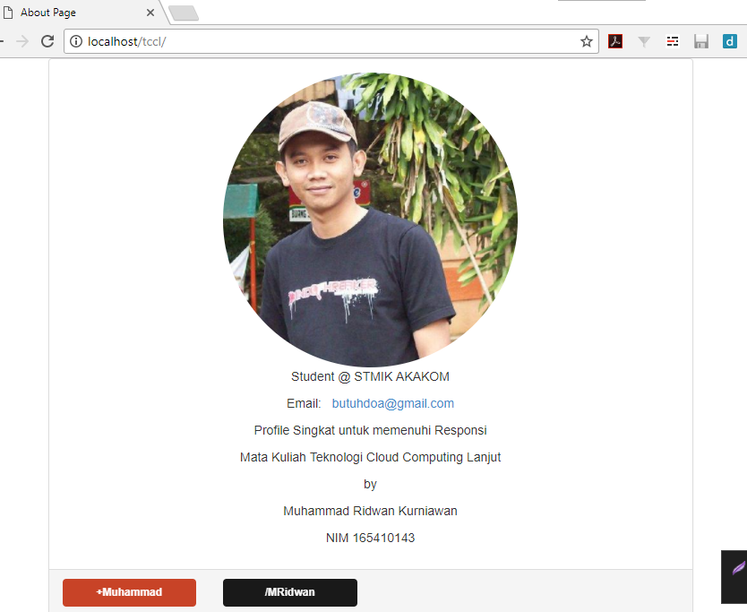
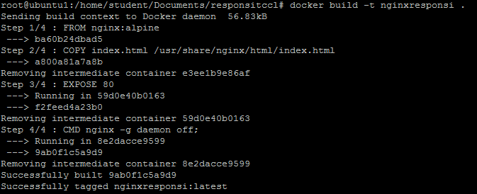
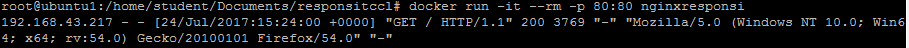
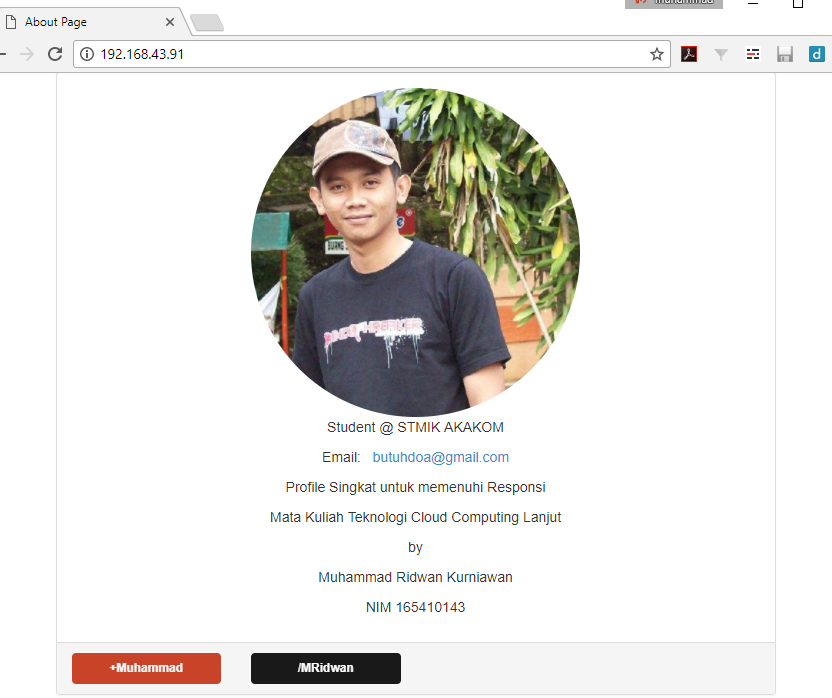

**RESPONSI TCCL**
by *Muhammad Ridwan Kurniawan NIM 165410143*

**Aplikasi yang dibuat:** Halaman profile menggunakan html seperti gambar berikut uji coba diserver local:

**Dockerfile:**
berikut config Dockerfile yang digunakan:

    FROM nginx:alpine
    
    COPY index.html /usr/share/nginx/html/index.html
    
    EXPOSE 80
    CMD ["nginx", "-g", "daemon off;"]

**Penjelasannya:** 

 1. menggunakan images *nginx:alpine* agar ukurannya tidak terlalu besar.
 2. COPY: untuk memindahkan file local index.html ke dalam docker
 3. EXPOSE 80: port yang akan digunakan dalam docker
 4. perintah CMD untuk menjalankan nginx 

**Perintah Build Image:**   *docker build -t nginxresponsi .*
memberikan nama images: nginxresponsi

**Perintah menjalankannya:** *docker run -it --rm -p 80:80 nginxresponsi*

**Hasil jika dijalankan:**

pada output ini url/ip *192.168.43.91* merupakan ip bridge virtualbox yang digunakan sebagai host Docker

**Docker Hub Images**
https://hub.docker.com/r/butuhdoa/responsitccl/

**Prestasi:**
 1. Github Star Project 25 star: https://github.com/MRidwanKurniawan/usergrid-vagrant
 2. Github Contribution: https://github.com/CachetHQ/Docker/pull/202
 3. Github Contribution: https://github.com/mathletes/website/pull/19
